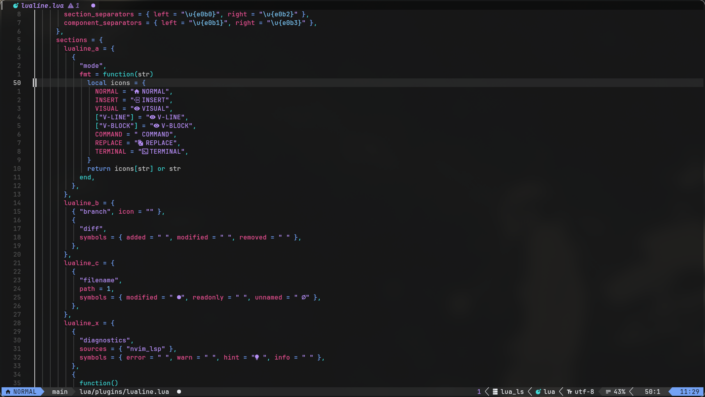

# nvim

My personal Neovim configuration built on top of [LazyVim](https://lazyvim.org).

<!--  -->

---

## Requirements

- Neovim >= 0.9.0
- Git
- [JetBrainsMono Nerd Font](https://www.nerdfonts.com/) (or any Nerd Font that you preffer)
- A true-color terminal I use [Kitty](https://sw.kovidgoyal.net/kitty/) btw
- `ripgrep` and `fd` for file search

## Installation

> Back up your existing config before proceeding.

```sh
mv ~/.config/nvim ~/.config/nvim.bak
git clone https://github.com/igbtw/nvim ~/.config/nvim
nvim
```

Plugins will install automatically on first launch via lazy.nvim.

## Structure

```
~/.config/nvim/
├── init.lua
├── lazyvim.json
├── lazy-lock.json
├── stylua.toml
└── lua/
    ├── config/
    │   ├── autocmds.lua
    │   ├── keymaps.lua
    │   ├── lazy.lua
    │   └── options.lua
    └── plugins/
        ├── bufferline.lua
        ├── colorscheme.lua
        ├── gitsigns.lua
        ├── indent-blankline.lua
        ├── lualine.lua
        ├── noice.lua
        └── trouble.lua
```

## Plugins

| Plugin | Purpose |
|--------|---------|
| [nyoom-engineering/oxocarbon.nvim](https://github.com/nyoom-engineering/oxocarbon.nvim) | Colorscheme |
| [nvim-lualine/lualine.nvim](https://github.com/nvim-lualine/lualine.nvim) | Statusline with custom IBM Carbon palette and powerline separators |
| [akinsho/bufferline.nvim](https://github.com/akinsho/bufferline.nvim) | Buffer tab line with LSP diagnostics |
| [folke/noice.nvim](https://github.com/folke/noice.nvim) | Replaces cmdline, messages and popups with a modern UI |
| [folke/trouble.nvim](https://github.com/folke/trouble.nvim) | Diagnostics panel for document and workspace errors |
| [lewis6991/gitsigns.nvim](https://github.com/lewis6991/gitsigns.nvim) | Git hunk navigation, staging and inline blame |
| [lukas-reineke/indent-blankline.nvim](https://github.com/lukas-reineke/indent-blankline.nvim) | Indentation guides |

## Keymaps

Leader key: `Space`

### Buffers

| Key | Action |
|-----|--------|
| `Shift+h` | Previous buffer |
| `Shift+l` | Next buffer |
| `<leader>bp` | Toggle pin |
| `<leader>bP` | Close unpinned buffers |
| `<leader>bo` | Close other buffers |

### Git (Gitsigns)

| Key | Action |
|-----|--------|
| `]h` | Next hunk |
| `[h` | Previous hunk |
| `<leader>ghs` | Stage hunk |
| `<leader>ghr` | Reset hunk |
| `<leader>ghS` | Stage buffer |
| `<leader>ghu` | Undo stage hunk |
| `<leader>ghR` | Reset buffer |
| `<leader>ghp` | Preview hunk |
| `<leader>ghb` | Blame line |
| `<leader>ghd` | Diff this |

### Diagnostics (Trouble)

| Key | Action |
|-----|--------|
| `<leader>xx` | Document diagnostics |
| `<leader>xX` | Workspace diagnostics |
| `<leader>xL` | Location list |
| `<leader>xQ` | Quickfix list |

### Noice

| Key | Action |
|-----|--------|
| `<leader>snl` | Last message |
| `<leader>snh` | Message history |
| `<leader>sna` | All messages |
| `<leader>snd` | Dismiss all |

## Statusline

The lualine statusline uses a hand-crafted [IBM Carbon](https://carbondesignsystem.com/) color palette with powerline separators. Each mode has its own accent color — blue for normal, green for insert, purple for visual, pink for replace, and yellow for command. It also displays the active LSP clients, diagnostics, filetype, encoding, cursor position, and a clock.

## Environment that i use

| | |
|-|-|
| OS | CachyOS (Arch-based) |
| WM | Hyprland |
| Terminal | Kitty |
| Font | JetBrainsMono Nerd Font |
